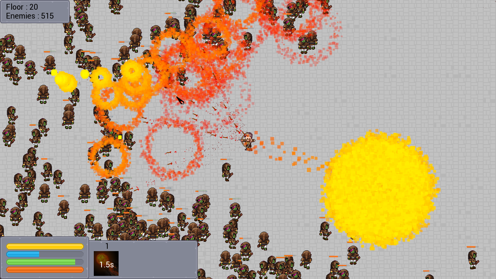
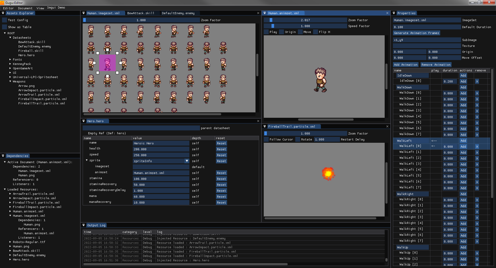

# gugu::Engine 0.8.0-post

A minimalist 2D game engine, written in C++, mainly based on SFML, ImGui, and PugiXml.

Author : Legulysse  
Contributors : Diccy, Amitsouko

## Dependencies

- [SFML 2.6.1](https://github.com/SFML/SFML) : used by the Engine.  
- [PugiXml 1.13](https://github.com/zeux/pugixml) : used by the Engine.  
- [ImGui 1.87-docking](https://github.com/ocornut/imgui) : used by the Editor.  
- [ImGui-SFML 2.6](https://github.com/SFML/imgui-sfml) : used for the ImGui integration.  
- [Python 3.x](https://www.python.org/) : used for build and utility scripts.  
- [Premake 5.0.0-beta1](https://premake.github.io/) : used by build scripts.  

## Docs

- [Changelog](./Docs/ProjectHistory.md) (French)  
- [Features](./Docs/Features.md)  
- [Console Commands](./Docs/Commands.md)  

## Quick Overview

### Setup

The project makefiles are generated through Premake.  

You can use /Tools/Build.py to spawn a little prompt with a menu to select your target (visual studio, gnu makefile, etc).  
Alternatively, you can use /Tools/Build_vs2019.bat to generate the visual2019 build files directly, without using python.  
The generated project files will be available in /Dev/Build.  

### Engine

You can find the engine code itself in /Dev/SourcesEngine.  
It's mostly made of c++ classes, with an additionnal python script (DatasheetBindingTool) used to generate xml binding code for the datasheet system.  

### Demos

You can find several little demos in /Dev/SourcesDemos.  
Those demos are very small unit cases, showing individual engine systems at work.  
Once compiled, most of them will run in /Version/DemoTests.  

The demo Game is a bit bigger, and is aimed to become a sample of a fully functional mini roguelike, to show all of the engine systems working together.  
This demo will run in /Version/DemoGame.  

### Editor

You can find the editor in /Tools/GuguEditor.  
Its sources can be found in /Dev/SourcesEditor and /Dev/SourcesEditorApp.  
The editor allows the edition of gameplay datasheets, imagesets, animsets, and particle effects.  

